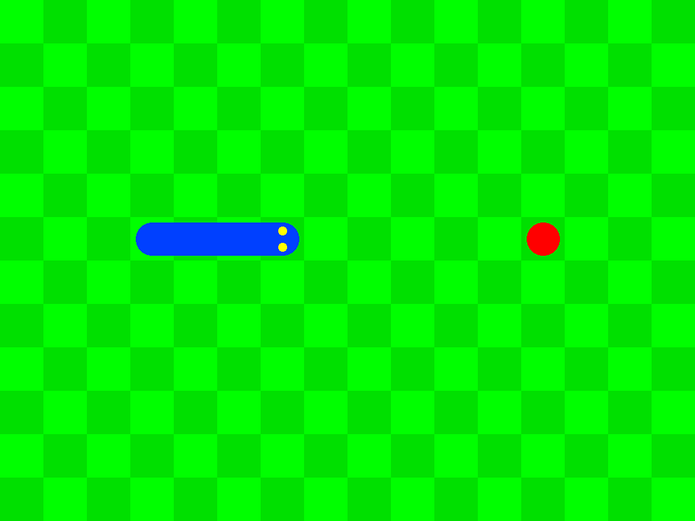

Snake Game (SDL2)
=================

Language and Libraries
----------------------

- [C++17](https://isocpp.org/)
- [SDL2](https://www.libsdl.org/)
- [SDL_mixer](https://www.libsdl.org/projects/SDL_mixer/)
- [SDL_ttf](https://www.libsdl.org/projects/SDL_ttf/)
- [[SDL2] Draw and fill a circle](https://gist.github.com/Gumichan01/332c26f6197a432db91cc4327fcabb1c)

Resources and References
------------------------

- [Snake Chan Font | dafont.com](https://www.dafont.com/snake-chan.font)
- [Ukulele | Royalty Free Music](https://www.bensound.com/royalty-free-music/track/ukulele)
- [Menu Selection Click | OpenGameArt.org](https://opengameart.org/content/menu-selection-click)
- [Game tone, short and fast stuttering positive sound 3 - ZapSplat - Download free sound effects](https://www.zapsplat.com/music/game-tone-short-and-fast-stuttering-positive-sound-3/)
- [Download Big Dart Weapon Sound Effects – Free Download](https://www.noiseforfun.com/2012-sound-effects/big-dart/)
- [Madhav, Game Programming in C++: Creating 3D Games | Pearson](https://www.pearson.com/us/higher-education/program/Madhav-Game-Programming-in-C-Creating-3-D-Games/PGM1102283.html)
